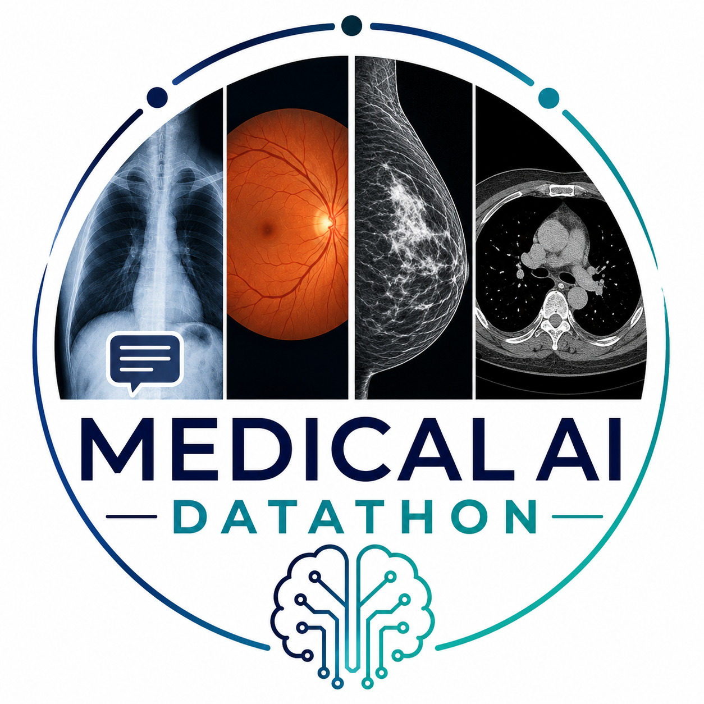

# Medical AI Datathon

<p align="center">
  
</p>

## English

This repository contains the code used to download, clean, and preprocess the
medical imaging datasets prepared for the Medical AI Datathon. The goal is to
provide participant-friendly datasets with simple file structures,
metadata/label CSV files, and example notebooks showing how to load and inspect
the data. The collection is broad enough to be reused in future medical AI
datathons or educational challenges.

The datasets are available in the Hugging Face collection:
https://huggingface.co/collections/dsrestrepo/medical-ai-datathon

The repository contains preprocessing code for four datasets:

- **MIMIC-CXR**: chest X-ray images with multi-label thoracic findings and
  radiology reports.
- **mBRSET**: retinal fundus images with ophthalmology labels, clinical
  variables, and demographic metadata.
- **CBIS-DDSM**: mammography images with breast lesion labels and case
  metadata.
- **LIDC-IDRI**: 3D chest CT volumes with radiologist annotations for lung
  nodules.

For more details about each dataset, participants should check the original
dataset sources/papers and the `README.md` file inside each clean dataset
folder.

### Clean Dataset Folders

The clean datasets are expected under a root folder such as:

```text
PATH-TO-DATASET/
```

#### MIMIC-CXR

```text
PATH-TO-DATASET/MIMIC-CXR/
├── images/
├── train.csv
├── valid.csv
├── test.csv
└── README.md
```

Contains 224x224 chest X-ray JPG images. The CSV files include image names,
study metadata, demographic variables, CheXpert-style labels, and the
`report` text.

Possible tasks:

- Multi-label chest X-ray classification.
- Report-aware or multimodal modeling.
- Subgroup or fairness analysis using metadata.

Original sources:

- Paper: https://www.nature.com/articles/s41597-019-0322-0
- Dataset: https://physionet.org/content/mimic-cxr/

#### mBRSET

```text
PATH-TO-DATASET/mBRSET/
├── images/
├── metadata.csv
└── README.md
```

Contains retinal fundus JPG images. `metadata.csv` includes one row per image
with clinical variables, demographic variables, image quality fields, and
retinal labels.

Possible tasks:

- Diabetic retinopathy severity prediction using `final_icdr`.
- Edema prediction using `final_edema`.
- Glaucoma-related screening using `increased_cdr`.
- Subgroup, robustness, or fairness analysis.

Original sources:

- Paper: https://www.nature.com/articles/s41597-025-04627-3
- Dataset: https://physionet.org/content/mbrset/

#### CBIS-DDSM

```text
PATH-TO-DATASET/CBIS-DDSM-clean/
├── images/
├── labels.csv
└── README.md
```

Contains resized full mammogram PNG images. The main Hugging Face dataset
`cbis` uses 448x448 images. An alternative 224x224 version is available
separately as `cbis224`. `labels.csv` includes image names, pathology labels,
breast-view metadata, abnormality descriptors, and a binary `is_malignant`
label.

Possible tasks:

- Binary benign vs malignant classification using `is_malignant`.
- Multiclass pathology classification using `pathology`.
- Mass vs calcification classification using `abnormality_type`.
- Assessment prediction or subgroup analysis.

Original source: https://www.cancerimagingarchive.net/collection/cbis-ddsm/

#### LIDC-IDRI

```text
PATH-TO-DATASET/LIDC-IDRI-clean-224/
├── volumes/
├── reader_level.csv
├── nodule_level.csv
├── ct_level.csv
├── preprocessing_summary.json
└── README.md
```

The Hugging Face dataset key `lidc224` uses 224x224 CT slices. An alternative
384x384 version is available separately as `lidc384`:

```text
PATH-TO-DATASET/LIDC-IDRI-clean-384/
```

Contains 3D CT volumes stored as compressed `.npz` files. Each volume has shape
`(height, width, slices)`. Labels are available at reader/annotation level,
approximate nodule level, and derived CT-scan level.

Possible tasks:

- CT-level suspicious nodule or malignancy-risk classification using
  `has_malignant_or_high_suspicion`.
- CT-level multiclass classification using `ct_malignancy_class`.
- Reader-level or nodule-level analysis using the additional CSV files.

Original source: https://www.cancerimagingarchive.net/collection/lidc-idri/

### Notebooks

The notebooks in `datathon/notebooks/` are meant to be small entry points for
participants. They show how to point to a local dataset folder, read the label
files, inspect the available columns, and display representative images or CT
volumes.

- `01_mimic_cxr_overview.ipynb`: reads the MIMIC-CXR split CSV files, inspects
  the chest X-ray labels and reports, and displays example X-ray images.
- `02_mbrset_overview.ipynb`: reads the mBRSET metadata file, summarizes
  retinal labels such as diabetic retinopathy and edema, and displays fundus
  images.
- `03_cbis_ddsm_overview.ipynb`: reads `labels.csv` for CBIS-DDSM, inspects
  pathology and abnormality labels, and displays resized mammography images.
- `04_lidc_idri_overview.ipynb`: reads the LIDC-IDRI CT-level, nodule-level,
  and reader-level CSV files, then visualizes slices from the 3D CT volumes.
- `05_mimic_cxr_medsiglip_embeddings.ipynb`: demonstrates MedSigLIP image/text
  embeddings and simple zero-shot prompts for MIMIC-CXR.
- `06_mbrset_medsiglip_embeddings.ipynb`: demonstrates MedSigLIP embeddings,
  ophthalmology prompts, and a PCA view for mBRSET.
- `07_cbis_ddsm_medsiglip_embeddings.ipynb`: demonstrates MedSigLIP embeddings,
  mammography prompts, and a PCA view for CBIS-DDSM.
- `08_lidc_idri_colipri_embeddings.ipynb`: demonstrates COLIPRI embeddings and
  simple lung nodule prompts for 3D LIDC-IDRI CT volumes.

### Environment Setup With uv

This repository includes a `pyproject.toml` file with the packages needed to
run the notebooks, read the images/volumes, and download gated datasets from
Hugging Face. It also includes PyTorch, Transformers, and COLIPRI so the same
environment can later be used to extract embeddings from foundation models such
as MedSigLIP or COLIPRI, or to train small local models on top of those
embeddings. The embedding examples use `scikit-learn` for simple PCA plots,
`sentencepiece` for the SigLIP tokenizer used by MedSigLIP, and `python-dotenv`
to load an optional local `.env` file containing `HF_TOKEN`.

From this repository root:

```bash
uv sync
```

Register the environment as a Jupyter kernel:

```bash
uv run python -m ipykernel install --user \
  --name medical-ai-datathon \
  --display-name "Medical AI Datathon"
```

Then open Jupyter in local:

```bash
uv run jupyter lab
```

Inside the notebooks, select the kernel named `Medical AI Datathon`.

### Download Datasets From Hugging Face

The datasets are hosted in gated Hugging Face repositories. After your access is
approved, authenticate once:

```bash
uv run hf auth login
```

Then download all datasets to a local folder:

```bash
uv run python scripts/download_hf_datasets.py \
  --output-dir /path/to/local/datasets \
  --datasets all
```

Download only selected datasets:

```bash
uv run python scripts/download_hf_datasets.py \
  --output-dir /path/to/local/datasets \
  --datasets mimic cbis lidc224
```

Available dataset keys:

- `mimic`: MIMIC-CXR.
- `mbrset`: mBRSET.
- `cbis`: CBIS-DDSM resized to 448x448.
- `cbis224`: CBIS-DDSM resized to 224x224.
- `lidc224`: LIDC-IDRI resized to 224x224.
- `lidc384`: LIDC-IDRI resized to 384x384.

Some datasets may be stored on Hugging Face with the image folder compressed as
`images.tar.gz` to avoid uploading tens of thousands of small image files. The
download script extracts this archive automatically, so after the command
finishes you should still work with a normal dataset folder containing
`images/`, CSV files, and `README.md`.

After download, point the notebooks to the folder you used as `--output-dir`.
For example:

```python
DATASET_DIR = Path("/path/to/local/datasets/MIMIC-CXR")
```

## Español

Este repositorio contiene el código usado para descargar, limpiar y preprocesar los
datasets de imágenes médicas preparados para el Medical AI Datathon. El objetivo
es entregar datasets fáciles de usar, con estructuras simples, archivos CSV de
metadatos/etiquetas y notebooks de ejemplo para cargar e inspeccionar los datos.
La colección es suficientemente general para reutilizarse en futuros datathons
de IA médica o retos educativos.

Los datasets están disponibles en la colección de Hugging Face:
https://huggingface.co/collections/dsrestrepo/medical-ai-datathon

El repositorio contiene código de preprocesamiento para cuatro datasets:

- **MIMIC-CXR**: radiografías de tórax con etiquetas multi-etiqueta de hallazgos
  torácicos y reportes radiológicos.
- **mBRSET**: imágenes de fondo de ojo con etiquetas oftalmológicas, variables
  clínicas y metadatos demográficos.
- **CBIS-DDSM**: mamografías con etiquetas de lesiones mamarias y metadatos de
  casos.
- **LIDC-IDRI**: volúmenes CT 3D de tórax con anotaciones de radiólogos para
  nódulos pulmonares.

Para más información sobre cada dataset, los participantes pueden consultar las
fuentes/papers originales y el archivo `README.md` dentro de cada carpeta limpia
del dataset.

### Carpetas Limpias de Datasets

Los datasets limpios se esperan bajo una carpeta raíz como:

```text
PATH-TO-DATASET/
```

#### MIMIC-CXR

```text
PATH-TO-DATASET/MIMIC-CXR/
├── images/
├── train.csv
├── valid.csv
├── test.csv
└── README.md
```

Contiene radiografías de tórax JPG de 224x224. Los CSV incluyen nombres de
imagen, metadatos del estudio, variables demográficas, etiquetas tipo CheXpert y
el texto del `report`.

Tareas posibles:

- Clasificación multi-etiqueta de radiografías de tórax.
- Modelado multimodal o con reportes.
- Análisis por subgrupos o equidad usando metadatos.

Fuentes originales:

- Paper: https://www.nature.com/articles/s41597-019-0322-0
- Dataset: https://physionet.org/content/mimic-cxr/

#### mBRSET

```text
PATH-TO-DATASET/mBRSET/
├── images/
├── metadata.csv
└── README.md
```

Contiene imágenes JPG de fondo de ojo. `metadata.csv` incluye una fila por
imagen con variables clínicas, variables demográficas, campos de calidad de
imagen y etiquetas retinianas.

Tareas posibles:

- Predicción de severidad de retinopatía diabética usando `final_icdr`.
- Predicción de edema usando `final_edema`.
- Tamizaje relacionado con glaucoma usando `increased_cdr`.
- Análisis por subgrupos, robustez o equidad.

Fuentes originales:

- Paper: https://www.nature.com/articles/s41597-025-04627-3
- Dataset: https://physionet.org/content/mbrset/

#### CBIS-DDSM

```text
PATH-TO-DATASET/CBIS-DDSM-clean/
├── images/
├── labels.csv
└── README.md
```

Contiene mamografías completas redimensionadas en formato PNG. El dataset
principal en Hugging Face, `cbis`, usa imágenes de 448x448. Una versión
alternativa de 224x224 está disponible por separado como `cbis224`.
`labels.csv` incluye nombres de imagen, etiquetas patológicas, metadatos de
vista mamaria, descriptores de anormalidades y una etiqueta binaria
`is_malignant`.

Tareas posibles:

- Clasificación binaria benigno vs maligno usando `is_malignant`.
- Clasificación multiclase de patología usando `pathology`.
- Clasificación masa vs calcificación usando `abnormality_type`.
- Predicción de assessment o análisis por subgrupos.

Fuente original: https://www.cancerimagingarchive.net/collection/cbis-ddsm/

#### LIDC-IDRI

```text
PATH-TO-DATASET/LIDC-IDRI-clean-224/
├── volumes/
├── reader_level.csv
├── nodule_level.csv
├── ct_level.csv
├── preprocessing_summary.json
└── README.md
```

La llave de Hugging Face `lidc224` usa cortes CT de 224x224. Una versión
alternativa de 384x384 está disponible por separado como `lidc384`:

```text
PATH-TO-DATASET/LIDC-IDRI-clean-384/
```

Contiene volúmenes CT 3D guardados como archivos `.npz` comprimidos. Cada
volumen tiene forma `(height, width, slices)`. Las etiquetas están disponibles
a nivel de lector/anotación, nivel aproximado de nódulo y nivel CT derivado.

Tareas posibles:

- Clasificación CT-level de sospecha de nódulo o riesgo de malignidad usando
  `has_malignant_or_high_suspicion`.
- Clasificación multiclase CT-level usando `ct_malignancy_class`.
- Análisis a nivel de lector o nódulo usando los CSV adicionales.

Fuente original: https://www.cancerimagingarchive.net/collection/lidc-idri/

### Notebooks

Los notebooks en `datathon/notebooks/` están pensados como puntos de entrada
sencillos para participantes. Muestran cómo apuntar a una carpeta local del
dataset, leer los archivos de etiquetas, inspeccionar las columnas disponibles
y visualizar imágenes o volúmenes CT representativos.

- `01_mimic_cxr_overview.ipynb`: lee los CSV por split de MIMIC-CXR,
  inspecciona las etiquetas y reportes de radiografías de tórax, y muestra
  imágenes de ejemplo.
- `02_mbrset_overview.ipynb`: lee el archivo de metadata de mBRSET, resume
  etiquetas retinales como retinopatía diabética y edema, y muestra imágenes de
  fondo de ojo.
- `03_cbis_ddsm_overview.ipynb`: lee `labels.csv` de CBIS-DDSM, inspecciona
  etiquetas de patología y tipo de anormalidad, y muestra mamografías
  redimensionadas.
- `04_lidc_idri_overview.ipynb`: lee los CSV a nivel CT, nódulo y lector de
  LIDC-IDRI, y visualiza cortes de los volúmenes CT 3D.
- `05_mimic_cxr_medsiglip_embeddings.ipynb`: muestra embeddings de imagen/texto
  con MedSigLIP y prompts zero-shot simples para MIMIC-CXR.
- `06_mbrset_medsiglip_embeddings.ipynb`: muestra embeddings con MedSigLIP,
  prompts de oftalmología y una vista PCA para mBRSET.
- `07_cbis_ddsm_medsiglip_embeddings.ipynb`: muestra embeddings con MedSigLIP,
  prompts de mamografía y una vista PCA para CBIS-DDSM.
- `08_lidc_idri_colipri_embeddings.ipynb`: muestra embeddings con COLIPRI y
  prompts simples sobre nódulos pulmonares para volúmenes CT 3D de LIDC-IDRI.

### Configuración del Entorno con uv

Este repositorio incluye un archivo `pyproject.toml` con los paquetes necesarios
para ejecutar los notebooks, leer imágenes/volúmenes y descargar datasets gated
desde Hugging Face. También incluye PyTorch, Transformers y COLIPRI para que el
mismo entorno pueda usarse más adelante para extraer embeddings de modelos
fundacionales como MedSigLIP o COLIPRI, o entrenar modelos locales pequeños
sobre esos embeddings. Los ejemplos de embeddings usan `scikit-learn` para
gráficas PCA sencillas, `sentencepiece` para el tokenizer SigLIP usado por
MedSigLIP, y `python-dotenv` para cargar un archivo local opcional `.env` con
`HF_TOKEN`.

Desde la raíz de este repositorio:

```bash
uv sync
```

Registra el entorno como kernel de Jupyter:

```bash
uv run python -m ipykernel install --user \
  --name medical-ai-datathon \
  --display-name "Medical AI Datathon"
```

Abre Jupyter:

```bash
uv run jupyter lab
```

Dentro de los notebooks, selecciona el kernel `Medical AI Datathon`.

### Descargar Datasets Desde Hugging Face

Los datasets están alojados en repositorios gated de Hugging Face. Después de
que tu acceso sea aprobado, autentícate una vez:

```bash
uv run hf auth login
```

Descarga todos los datasets a una carpeta local:

```bash
uv run python scripts/download_hf_datasets.py \
  --output-dir /ruta/local/datasets \
  --datasets all
```

Descarga solo algunos datasets:

```bash
uv run python scripts/download_hf_datasets.py \
  --output-dir /ruta/local/datasets \
  --datasets mimic cbis lidc224
```

Llaves disponibles:

- `mimic`: MIMIC-CXR.
- `mbrset`: mBRSET.
- `cbis`: CBIS-DDSM redimensionado a 448x448.
- `cbis224`: CBIS-DDSM redimensionado a 224x224.
- `lidc224`: LIDC-IDRI redimensionado a 224x224.
- `lidc384`: LIDC-IDRI redimensionado a 384x384.

Algunos datasets pueden estar almacenados en Hugging Face con la carpeta de
imágenes comprimida como `images.tar.gz` para evitar subir decenas de miles de
imágenes pequeñas. El script de descarga extrae este archivo automáticamente,
así que después de terminar el comando deberías trabajar con una carpeta normal
del dataset que contiene `images/`, archivos CSV y `README.md`.

Después de descargar, apunta los notebooks a la carpeta usada en `--output-dir`.
Por ejemplo:

```python
DATASET_DIR = Path("/ruta/local/datasets/MIMIC-CXR")
```
